# 🚀 TechoVerse – AI Powered Project Management Platform

> **Sprint 15 | Prodesk IT Full Stack Development Internship**

A full-stack Project Management Platform built using **React.js, Node.js, Express.js, MongoDB Atlas, JWT Authentication, Stripe Checkout, and Recharts**.

---

# 📌 Project Overview

TechoVerse is a secure project management application that enables authenticated users to create, manage, update, and delete projects while visualizing project progress through interactive analytics.

Sprint 15 focuses on completing the full CRUD lifecycle, secure data ownership, premium subscription integration, and dashboard analytics.

---

# 🎯 Sprint Objective

Implement production-ready core functionality by completing:

- Secure CRUD Operations
- JWT Protected REST APIs
- User Data Ownership
- Stripe Payment Integration
- Dashboard Analytics
- Responsive UI

---

# ✨ Features

## Authentication

- User Registration
- User Login
- JWT Authentication
- Protected Routes
- React Context API
- Persistent Login

---

## Project Management

- Create Projects
- View User Projects
- Edit Existing Projects
- Delete Projects
- Form Validation
- Search & Filter Projects

---

## Security

- JWT Protected APIs
- User Ownership Validation
- MongoDB Authorization
- Unauthorized Access Prevention
- Password Hashing (bcrypt)

---

## Dashboard

- User Statistics
- Project Summary
- Completion Rate
- Premium Membership Status
- Recent Projects
- Quick Actions
- Responsive Layout

---

## Analytics

- Recharts Integration
- Project Status Visualization
- Dynamic Dashboard Metrics
- Real-time Data Updates

---

## Premium Features

- Stripe Checkout Integration
- Premium Upgrade
- Premium Badge
- Subscription Status
- Payment History

---

# 🛠 Technology Stack

## Frontend

- React.js
- React Router DOM
- Axios
- CSS Modules
- Recharts
- React Icons

---

## Backend

- Node.js
- Express.js

---

## Database

- MongoDB Atlas
- Mongoose

---

## Authentication

- JWT
- bcryptjs

---

## Payment

- Stripe Checkout (Test Mode)

---

## Deployment

- Frontend – Vercel
- Backend – Render

---

# 📂 Project Structure

```text
TechoVerse/

client/
│── components/
│── context/
│── pages/
│── services/
│── styles/

server/
│── config/
│── controllers/
│── middleware/
│── models/
│── routes/

README.md
Prompts.md
```

---

# 👤 User Schema

| Field | Type |
|---------|------|
| name | String |
| email | String |
| password | String |
| isPremium | Boolean |
| plan | String |
| paymentDate | Date |
| stripeSessionId | String |
| createdAt | Date |
| updatedAt | Date |

---

# 📦 Project Schema

| Field | Type |
|---------|------|
| title | String |
| description | String |
| status | String |
| user | ObjectId |
| createdAt | Date |
| updatedAt | Date |

---

# 🔐 Security

- JWT Authentication
- Protected Middleware
- User Ownership Validation
- Secure Password Hashing
- Environment Variables
- MongoDB Access Control

---

# 📡 REST APIs

## Authentication

POST /api/auth/register

POST /api/auth/login

GET /api/auth/profile

---

## Projects

GET /api/projects

POST /api/projects

PUT /api/projects/:id

DELETE /api/projects/:id

---

## Payments

POST /api/payment/create-checkout-session

GET /api/payment/success

---

# 📊 Dashboard Features

- Total Projects
- Completed Projects
- Pending Projects
- In Progress Projects
- Completion Percentage
- Premium Status
- Project Analytics Chart
- Recent Projects

---

# 📈 CRUD Workflow

✅ Create Project

✅ Read Projects

✅ Update Project

✅ Delete Project

All operations update the UI instantly without page refresh.

---

# 💳 Stripe Integration

- Test Mode Checkout
- Premium Upgrade
- Secure Payment Flow
- Success Redirect
- Premium Status Update
- Payment Stored in MongoDB

---

#  Testing

Completed Test Cases

- User Registration
- User Login
- Protected Routes
- JWT Validation
- Create Project
- Read Projects
- Update Project
- Delete Project
- Unauthorized Access
- Dashboard Analytics
- Stripe Checkout
- Premium Upgrade
- Responsive Design

---


## 🔐 Login

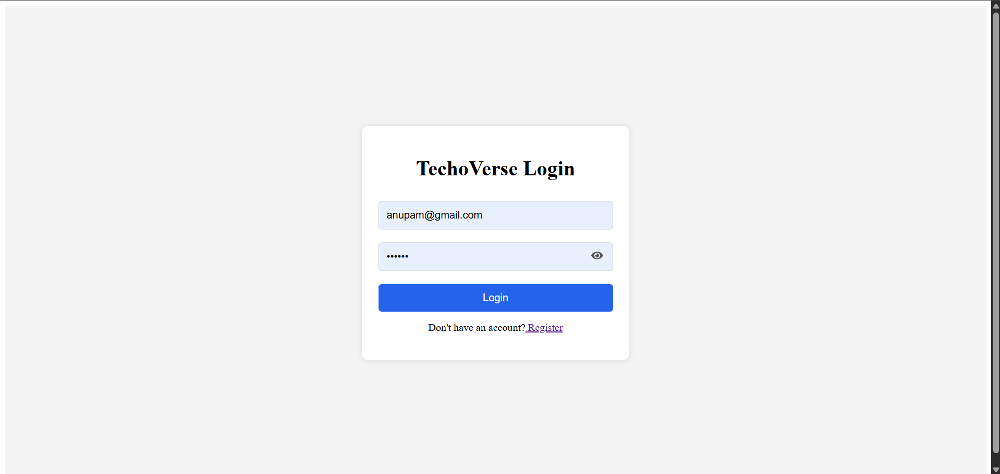

---

## 📝 Register

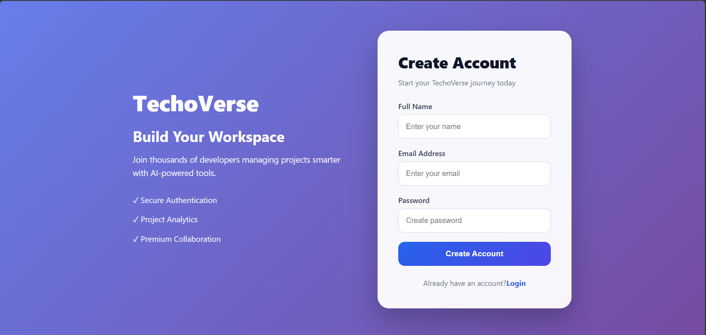


#  Sprint 15 Completion
## 📊 Dashboard

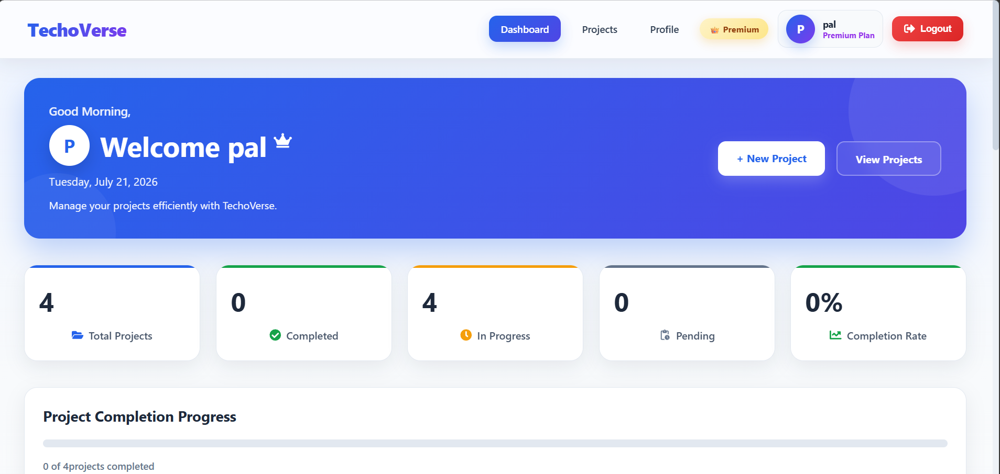


| Feature | Status |## 📁 Project Management

### Project List

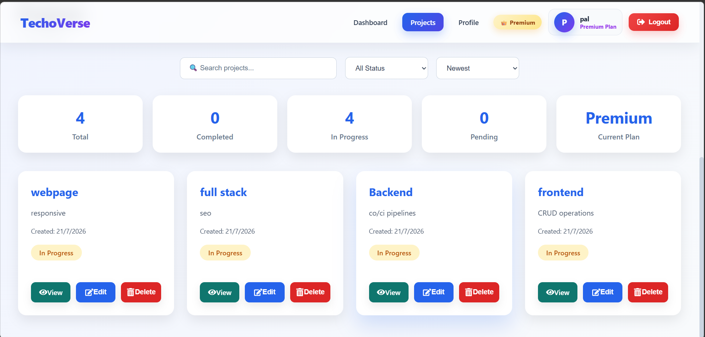

### Create Project

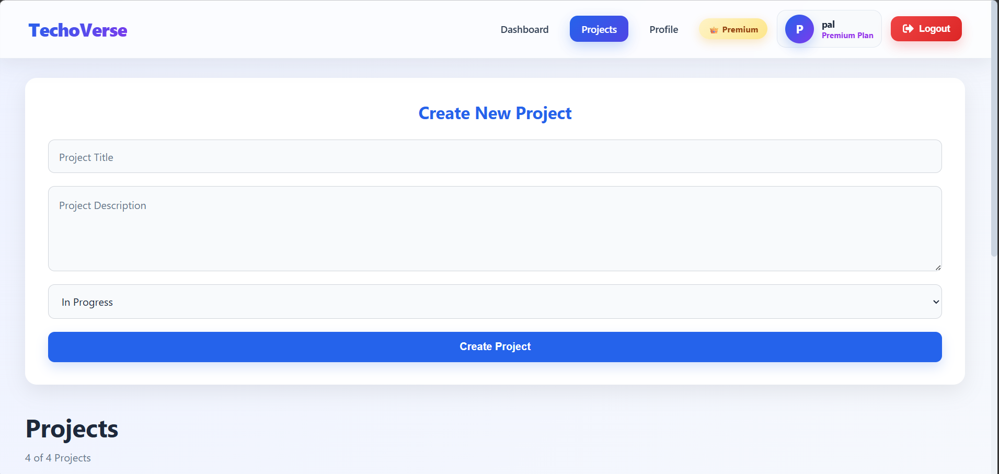

### Edit Project

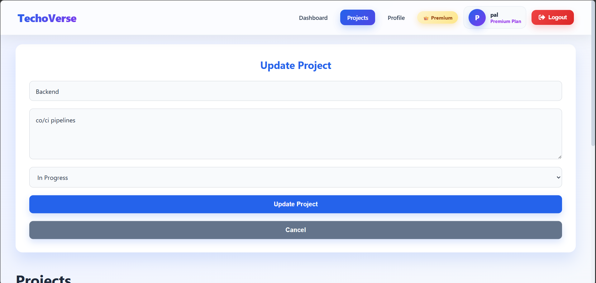

### Delete Project

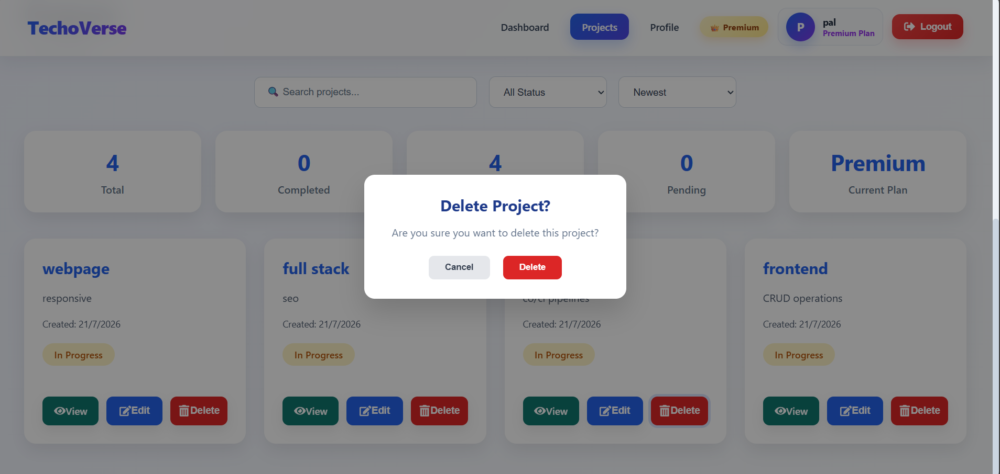## 📈 Dashboard Analytics

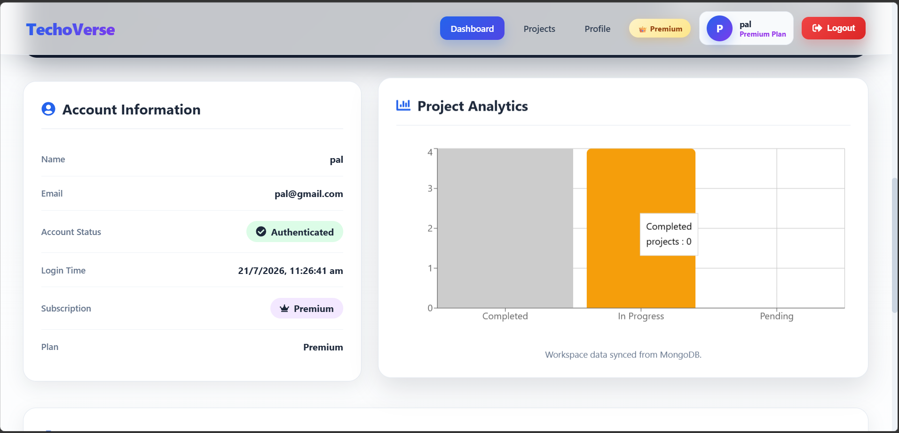

## 👑 Premium Membership

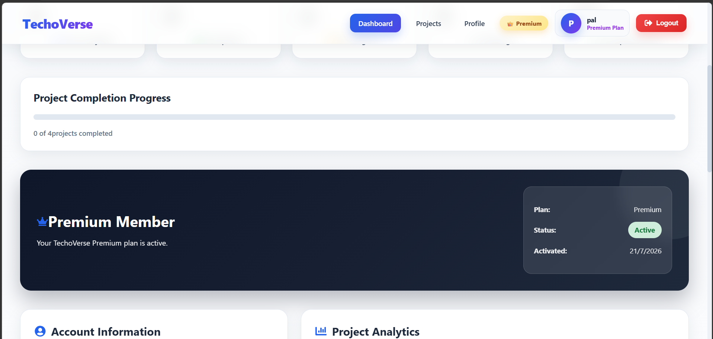

## 👤 Profile

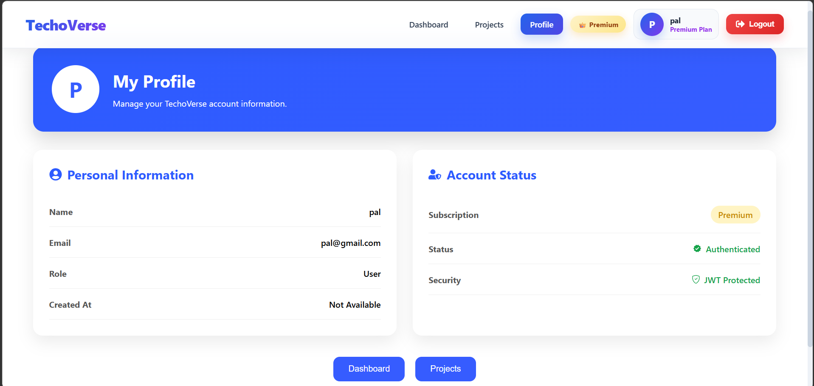

## Quick Actions

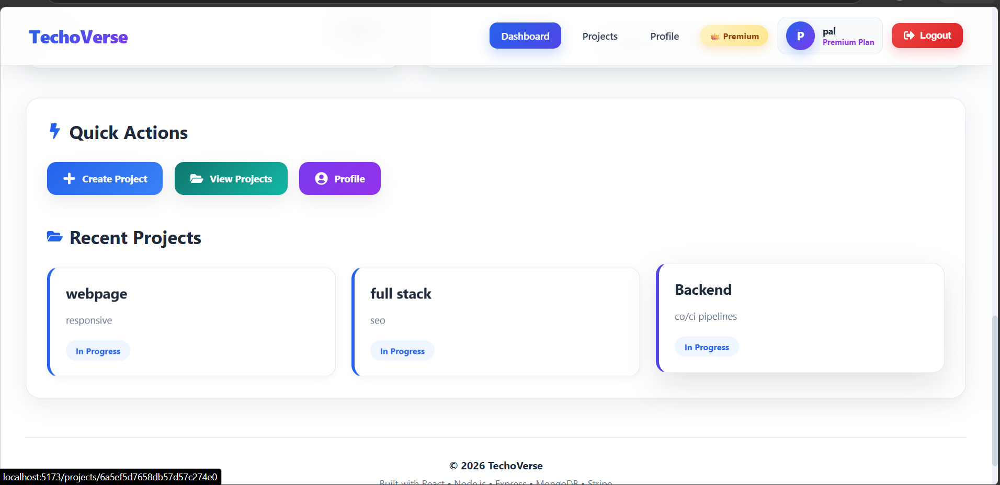

## 💳 Stripe Checkout

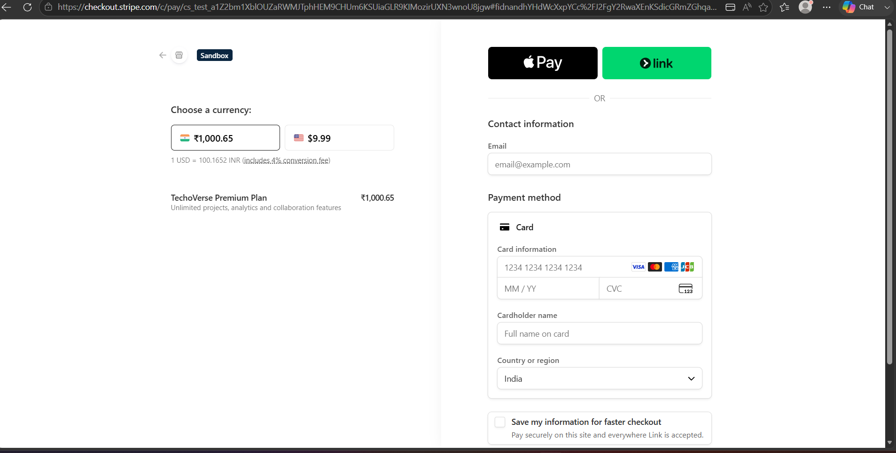


|----------|--------|
| Authentication | ✅ |
| JWT Protection | ✅ |
| Project CRUD | ✅ |## 📈 Dashboard Analytics## 👑 Premium Membership
| MongoDB Integration | ✅ |
| Ownership Validation | ✅ |
| Dashboard Analytics | ✅ |
| Recharts | ✅ |
| Stripe Checkout | ✅ |
| Premium Membership | ✅ |
| Responsive Dashboard | ✅ |

---


# 📅 Sprint Roadmap

### Sprint 13
- Product Planning
- PRD
- Wireframes
- ERD
- Architecture

### Sprint 14
- Authentication
- JWT
- Protected Routes

### Sprint 15
- Complete CRUD
- Dashboard Analytics
- Stripe Integration
- Premium Features

### Sprint 16
- UI Polish
- AI Assistant
- Notifications
- Calendar
- Team Collaboration

---

# 📚 Documentation

- README
- Prompts.md
- ERD
- Architecture Diagram
- API Documentation

---

# 👩‍💻 Author

**Anantha Lakshmi**

Prodesk IT – Full Stack Development Internship

Project: **TechoVerse**

Sprint: **15 – Feature Complete CRUD & Dashboard Analytics**

---

# 📄 License

This project is developed for educational and internship purposes as part of the **Prodesk IT Full Stack Development Internship Program**.
