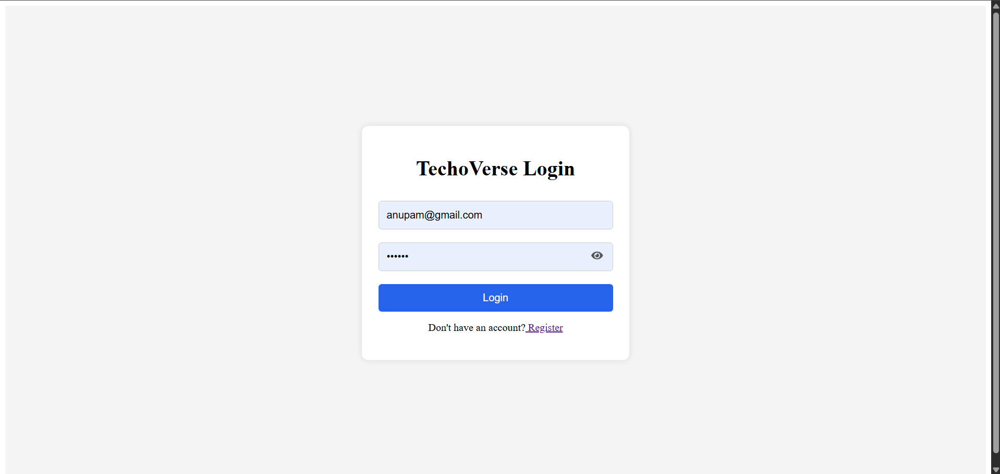
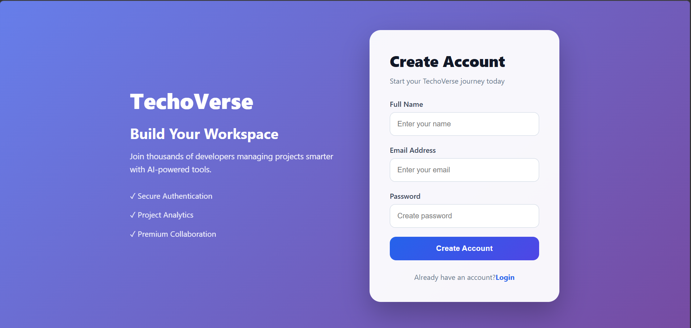
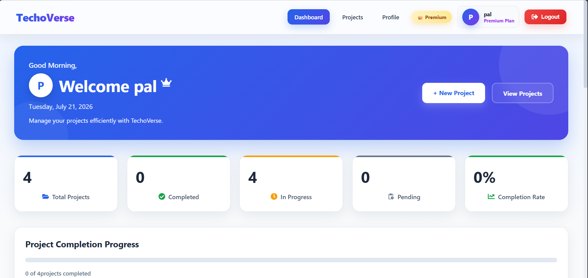
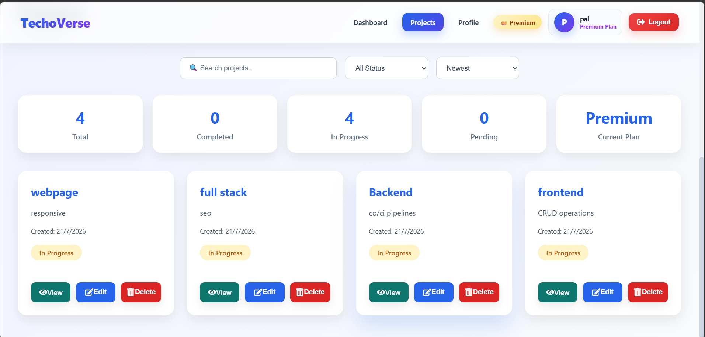
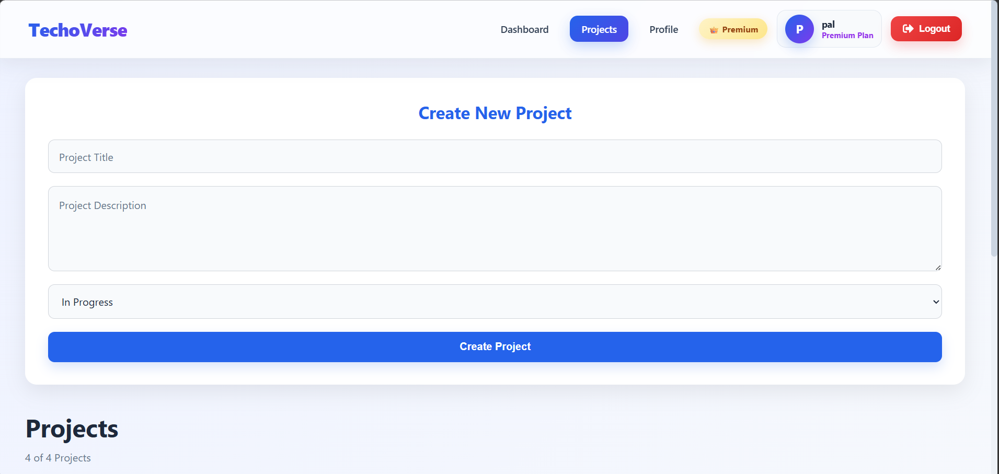
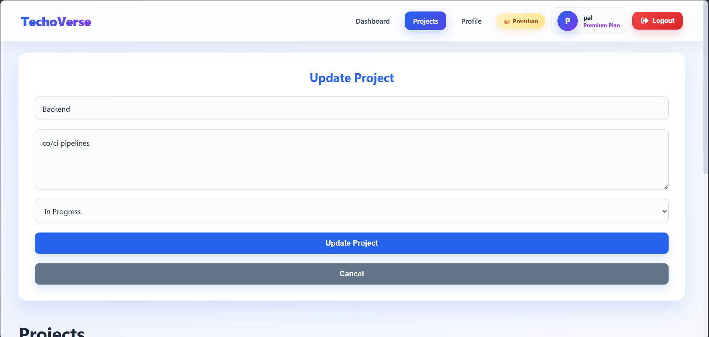
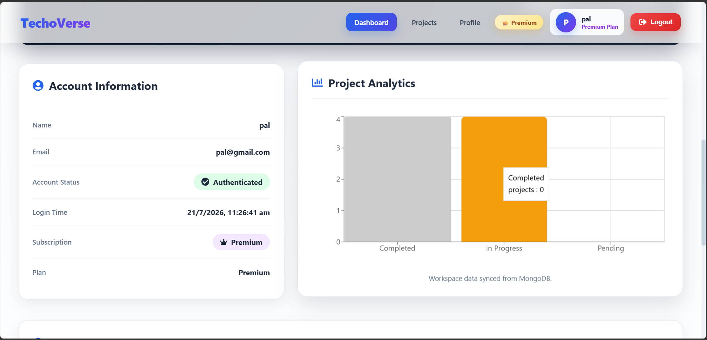
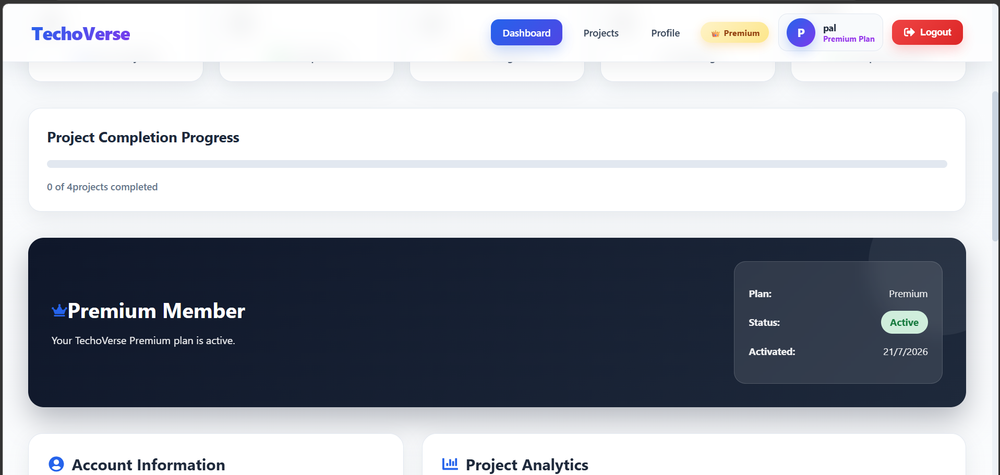
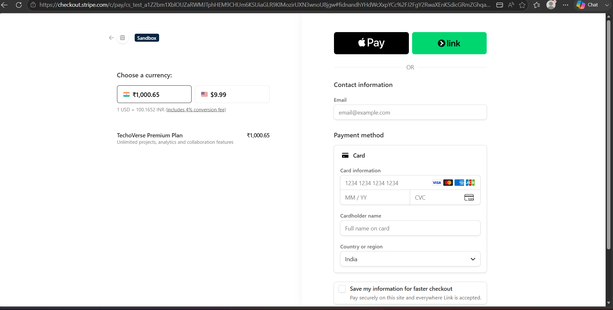
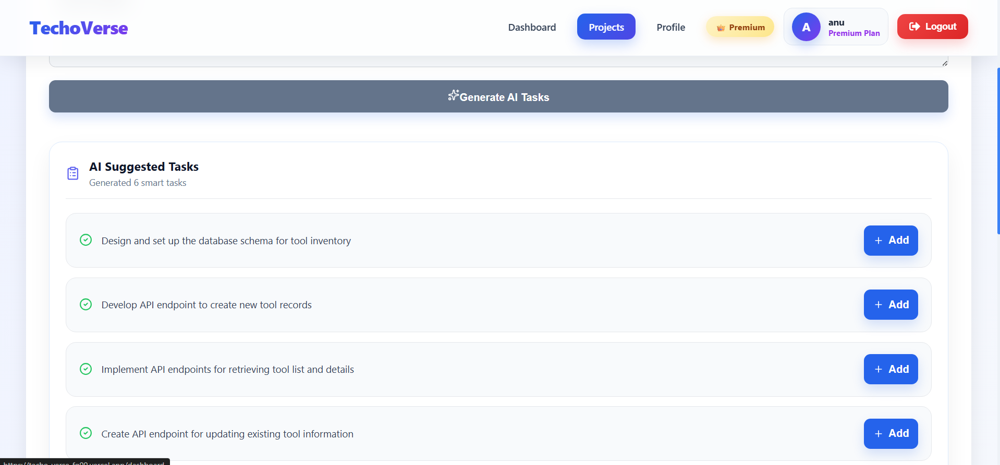

# 🚀 TechoVerse – AI Powered Project Management Platform

> **Prodesk IT Full Stack Development Internship (Sprint 13 – Sprint 16)**

TechoVerse is a full-stack AI-powered Project Management Platform designed to help users efficiently create, organize, track, and manage projects. The application provides secure authentication, project lifecycle management, dashboard analytics, premium membership integration, and AI-powered task suggestions to enhance productivity.

The project was developed incrementally across four internship sprints, evolving from project planning and authentication to a production-ready SaaS-style application with secure backend architecture and AI integration.

---

# 📌 Project Overview

TechoVerse enables authenticated users to:

- Register and securely log in
- Manage personal projects
- Track project progress
- Visualize project analytics
- Upgrade to Premium Membership
- Generate AI-powered project task suggestions
- Access a responsive dashboard across all devices

The application follows modern full-stack development practices using React, Node.js, Express, MongoDB Atlas, JWT Authentication, Stripe Checkout, Google Gemini AI, and production-ready backend validation.

---

# 🎯 Internship Sprint Progress

This project was completed over four development sprints.

| Sprint | Focus |
|---------|-------|
| Sprint 13 | Project Planning & System Design |
| Sprint 14 | Authentication & Backend Foundation |
| Sprint 15 | CRUD Operations, Dashboard & Premium Features |
| Sprint 16 | AI Integration, Backend Hardening & Production Polish |

---

# ✨ Final Features

## 🔐 Authentication

- User Registration
- Secure Login
- JWT Authentication
- Protected Routes
- Persistent Login
- React Context API
- Password Encryption using bcryptjs

---

## 📁 Project Management

- Create Projects
- View Projects
- Update Projects
- Delete Projects
- Search Projects
- Filter Projects
- Project Status Management

---

## 📊 Dashboard

- User Statistics
- Project Summary
- Completion Percentage
- Recent Projects
- Premium Status
- Quick Actions
- Responsive Dashboard

---

## 📈 Analytics

- Interactive Charts using Recharts
- Project Status Distribution
- Dynamic Statistics
- Real-Time Updates

---

## 👑 Premium Membership

- Stripe Checkout Integration
- Premium Upgrade
- Membership Badge
- Subscription Status
- Payment History

---

## 🤖 AI Assistant

- AI Task Suggestions
- Google Gemini Integration
- Server-side AI Processing
- Secure AI API
- Intelligent Project Planning

---

## 🛡 Security

- JWT Authentication
- Protected APIs
- User Ownership Validation
- Joi Validation
- Rate Limiting
- Standard Error Handling
- Environment Variable Protection

---

## 🎨 User Experience

- Fully Responsive Design
- Mobile Friendly Layout
- Loading Spinner
- Empty State UI
- Toast Notifications
- Improved Form Validation

---

# 🛠 Technology Stack

## Frontend

- React.js
- React Router DOM
- Axios
- CSS Modules
- React Icons
- Recharts
- React Hot Toast

---

## Backend

- Node.js
- Express.js

---

## Database

- MongoDB Atlas
- Mongoose ODM

---

## Authentication & Security

- JWT (JSON Web Token)
- bcryptjs
- Joi Validation
- express-rate-limit

---

## AI Integration

- Google Gemini API
- @google/generative-ai SDK

---

## Payment Gateway

- Stripe Checkout (Test Mode)

---

## Deployment

| Service | Platform |
|----------|----------|
| Frontend | Vercel |
| Backend | Render |
| Database | MongoDB Atlas |

---

# 📂 Project Structure

```text
TechoVerse/

├── client/
│   ├── public/
│   ├── src/
│   │   ├── assets/
│   │   ├── components/
│   │   ├── context/
│   │   ├── hooks/
│   │   ├── pages/
│   │   ├── services/
│   │   ├── styles/
│   │   ├── App.jsx
│   │   └── main.jsx
│   ├── package.json
│   └── vite.config.js
│
├── server/
│   ├── config/
│   ├── controllers/
│   ├── middleware/
│   ├── models/
│   ├── routes/
│   ├── services/
│   ├── validations/
│   ├── server.js
│   └── package.json
│
├── README.md
├── Prompts.md
└── .gitignore
```

---

# 🗄 Database Schema

## 👤 User Schema

| Field | Type | Description |
|---------|------|-------------|
| name | String | User Full Name |
| email | String | Unique Email Address |
| password | String | Hashed Password |
| isPremium | Boolean | Premium Membership Status |
| plan | String | Subscription Plan |
| paymentDate | Date | Premium Activation Date |
| stripeSessionId | String | Stripe Payment Session |
| createdAt | Date | Account Creation Time |
| updatedAt | Date | Last Updated Time |

---

## 📁 Project Schema

| Field | Type | Description |
|---------|------|-------------|
| title | String | Project Title |
| description | String | Project Description |
| status | String | Pending / In Progress / Completed |
| user | ObjectId | Project Owner |
| createdAt | Date | Created Date |
| updatedAt | Date | Updated Date |

---

# 🔐 Authentication Flow

1. User registers with a name, email, and password.
2. Password is securely hashed using **bcryptjs**.
3. User logs in with valid credentials.
4. A JWT token is generated and returned.
5. The frontend stores the token securely.
6. Protected API requests automatically include the JWT.
7. The backend verifies the token before processing requests.

---

# 🛡 Security Features

- JWT Authentication
- Password Hashing using bcryptjs
- Protected Routes
- User Ownership Validation
- Joi Request Validation
- Express Rate Limiting
- Environment Variables
- Secure AI Endpoint
- Standardized Error Responses
- Unauthorized Access Prevention

---

---

# 📡 REST API Documentation

The backend follows RESTful API architecture with secure JWT authentication, request validation, and standardized JSON responses.

---

## 🔐 Authentication APIs

| Method | Endpoint | Description |
|----------|----------------------------|-----------------------------|
| POST | `/api/auth/register` | Register a new user |
| POST | `/api/auth/login` | Authenticate user |
| GET | `/api/auth/profile` | Get logged-in user profile |

---

## 📁 Project APIs

| Method | Endpoint | Description |
|----------|--------------------------|------------------------------|
| GET | `/api/projects` | Fetch all user projects |
| POST | `/api/projects` | Create a new project |
| PUT | `/api/projects/:id` | Update a project |
| DELETE | `/api/projects/:id` | Delete a project |

---

## 🤖 AI APIs

| Method | Endpoint | Description |
|----------|------------------------|--------------------------------------|
| POST | `/api/ai/suggest` | Generate AI-powered project task suggestions |

---

## 💳 Payment APIs

| Method | Endpoint | Description |
|----------|-------------------------------------------|---------------------------|
| POST | `/api/payment/create-checkout-session` | Create Stripe checkout session |
| GET | `/api/payment/success` | Verify successful payment |

---

# 🤖 AI Integration (Sprint 16)

Sprint 16 introduces an AI-powered Project Assistant using the **Google Gemini API**.

The AI feature helps users automatically generate relevant project task suggestions based on the project title and description, improving planning and productivity.

### AI Workflow

1. User enters project title and description.
2. Frontend sends a request to the backend.
3. Backend validates the request using Joi.
4. Express server securely calls the Google Gemini API.
5. AI generates project task suggestions.
6. Sanitized response is returned to the frontend.
7. Suggestions are displayed to the user.

---

### AI Features

- AI-generated project task suggestions
- Google Gemini API Integration
- Server-side AI processing
- Secure environment variable configuration
- Sanitized AI responses
- Fast response generation

---

# 🔒 Backend Validation

To ensure data integrity and application security, all incoming request payloads are validated using **Joi** before interacting with MongoDB.

### Validated Requests

- User Registration
- User Login
- Project Creation
- Project Update
- AI Suggestion Request

### Benefits

- Prevents invalid data
- Reduces server errors
- Consistent validation messages
- Improved API reliability

---

# ⚠ Standardized Error Handling

The backend uses proper HTTP status codes and structured JSON responses.

### Status Codes

| Status Code | Description |
|-------------|-------------|
| 200 | Success |
| 201 | Resource Created |
| 400 | Bad Request |
| 401 | Unauthorized |
| 404 | Not Found |
| 500 | Internal Server Error |

All asynchronous controllers are wrapped with proper error handling to prevent unexpected server crashes.

---

# 🚦 Rate Limiting

To protect the backend infrastructure from abuse, rate limiting has been implemented using **express-rate-limit**.

### Protected Endpoints

- POST `/api/auth/login`
- POST `/api/ai/suggest`

### Benefits

- Prevents brute-force login attempts
- Prevents AI API abuse
- Protects server resources
- Improves application security

---

# 📊 Dashboard Features

The dashboard provides users with a real-time overview of their project activity.

### Dashboard Includes

- Total Projects
- Completed Projects
- Pending Projects
- In Progress Projects
- Completion Percentage
- Premium Membership Status
- Recent Projects
- Interactive Analytics Chart
- Quick Action Cards

---

# 📈 CRUD Workflow

The application supports complete CRUD functionality.

### Create

- Create new projects
- Form validation
- Instant UI update

### Read

- Fetch all projects
- Search functionality
- Filter by status

### Update

- Edit project details
- Update project status
- Real-time UI refresh

### Delete

- Delete projects securely
- User ownership verification
- Instant dashboard update

---

# 💳 Premium Membership

Premium functionality is powered by **Stripe Checkout**.

### Features

- Secure Stripe Checkout
- Premium Upgrade
- Payment Verification
- Premium Badge
- Membership Status
- Payment History
- MongoDB Payment Storage

---

---

# 🎨 UI/UX Improvements (Sprint 16)

Sprint 16 focuses on improving the overall user experience by making TechoVerse more polished, responsive, and production-ready.

---

## 📱 Responsive Design

The application is optimized for different screen sizes.

### Supported Devices

- Desktop
- Laptop
- Tablet
- Mobile Devices

### Improvements

- Responsive dashboard layout
- Mobile-friendly navigation
- Flexible project cards
- Optimized forms
- Improved spacing and alignment
- Better user interaction on small screens

---

# 🔔 User Notifications

Implemented modern toast-based notifications using **react-hot-toast**.

Browser alerts were replaced with non-blocking notifications.

### Notification Examples

- ✅ User login successful
- ✅ Project created successfully
- ✅ Project updated successfully
- ✅ Project deleted successfully
- ✅ AI suggestions generated
- ❌ Validation errors
- ❌ API failures

---

# ⏳ Loading & Empty States

Improved asynchronous user experience by adding proper feedback during data operations.

## Loading States

Implemented:

- Loading spinner components
- API request loading indicators
- Better network request feedback

## Empty States

Implemented branded empty-state UI for cases like:

- No projects available
- No search results found
- No recent activities

Users receive guidance about the next available action.

---

# 🧪 Testing

The application has been tested throughout all development sprints.

## Authentication Testing

✅ User Registration  
✅ User Login  
✅ JWT Token Generation  
✅ Protected Routes  
✅ Unauthorized Access Handling  

---

## Project Management Testing

✅ Create Project  
✅ View Projects  
✅ Update Project  
✅ Delete Project  
✅ Search Projects  
✅ Filter Projects  
✅ User Ownership Validation  

---

## Payment Testing

✅ Stripe Checkout Flow  
✅ Premium Upgrade  
✅ Payment Success Handling  
✅ Premium Status Update  

---

## AI Testing

✅ AI Endpoint Testing  
✅ Gemini API Response  
✅ Valid AI Request  
✅ Invalid Payload Handling  
✅ Secure Server-side AI Execution  

---

## Backend Security Testing

✅ Joi Validation Testing  
✅ Error Response Testing  
✅ Rate Limit Testing  
✅ API Protection Testing  

---

## UI Testing

✅ Desktop View  
✅ Mobile View  
✅ Responsive Navigation  
✅ Toast Notifications  
✅ Loading States  
✅ Empty States  

---

# 📸 Application Screenshots

## 🔐 Login



---

## 📝 Register



---

## 📊 Dashboard



---

## 📁 Projects



---

## ➕ Create Project



---

## ✏️ Edit Project



---

## 📈 Analytics Dashboard



---

## 👑 Premium Membership



---

## 💳 Stripe Checkout



---

## 🤖 AI Assistant



---

# 🚀 Deployment

The application is deployed using modern cloud platforms.

| Application | Platform |
|-------------|----------|
| Frontend | Vercel |
| Backend API | Render |
| Database | MongoDB Atlas |

---

# 📅 Sprint Development Timeline

## 🚀 Sprint 13 – Planning & Architecture

Completed:

- Product Requirement Document (PRD)
- Wireframes
- ER Diagram
- System Architecture
- Database Planning

---

## 🔐 Sprint 14 – Authentication Foundation

Completed:

- Backend Setup
- MongoDB Integration
- User Schema
- JWT Authentication
- Protected Routes
- Password Hashing

---

## 📊 Sprint 15 – CRUD & SaaS Features

Completed:

- Project CRUD Operations
- User Ownership Validation
- Dashboard Analytics
- Recharts Integration
- Search & Filtering
- Stripe Checkout Integration
- Premium Membership

---

## 🤖 Sprint 16 – AI & Production Polish

Completed:

- Google Gemini AI Integration
- AI Task Suggestions
- Joi Validation
- Standard Error Handling
- Rate Limiting
- Responsive UI Improvements
- Toast Notifications
- Loading States
- Empty States
- Production Code Cleanup

---

---

# 🚀 Sprint 17 – Production Deployment & E2E Integration

Sprint 17 focuses on deploying TechoVerse to production and validating the complete Full-Stack flow from the live frontend to the cloud backend and MongoDB Atlas.

## ☁️ Production Deployment

| Component | Platform |
|-----------|----------|
| Frontend | Vercel |
| Backend | Render |
| Database | MongoDB Atlas |

### Live URLs

- **Frontend:** `https://techo-verse-fg99.vercel.app`
- **Backend:** `https://techoverse-fpcd.onrender.com`

## 🔐 Production Security

- Configured MongoDB Atlas Network Access with `0.0.0.0/0`
- Restricted CORS to the live Vercel frontend
- Disabled wildcard (`*`) CORS access
- Excluded localhost from production CORS
- Configured production environment variables
- Protected sensitive credentials using environment variables

## 🔄 Live E2E Integration

The complete production flow was tested successfully:

```text
Vercel Frontend
      ↓
User Authentication
      ↓
Render Express Backend
      ↓
API Request Processing
      ↓
MongoDB Atlas
      ↓
Data Persistence

# 📚 Documentation

Project documentation includes:

- README.md
- Prompts.md
- API Documentation
- Database Schema
- Architecture Documentation

---

# 🔮 Future Enhancements

Possible future improvements:

- Team Collaboration
- Project Sharing
- Real-time Notifications
- Advanced AI Project Planning
- Calendar Integration
- Role-Based Access Control
- More Analytics Reports

---

# 👩‍💻 Author

**Anantha Lakshmi**

Prodesk IT – Full Stack Development Internship

Project: **TechoVerse**

Technology:  
React.js | Node.js | Express.js | MongoDB | JWT | Stripe | Google Gemini AI

---

# 📄 License

This project is developed for educational and internship purposes as part of the **Prodesk IT Full Stack Development Internship Program**.

---